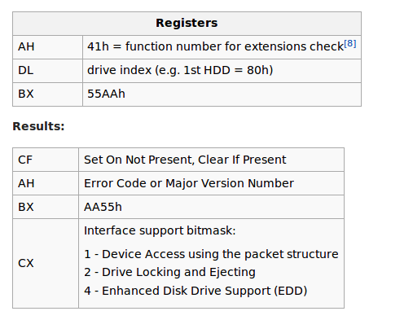

MBR\(Master Boot Recorder\)
===============================

MBR is part of grub2, it installed in the first sector of disk image. After BIOS initialization, MBR loaded to memory at address 0x7c00

Memory deloyment of MBR
-------------------------------

```shell 
0x7c00          +----------------------+
   446 bytes    | Boot Loader          |
                |                      |
                |                      |
                |                      |
                +----------------------+
   64 bytes     | Partition Table      |
                |                      |
                +----------------------+
   2 bytes      | Magic Signature      |
                +----------------------+
```

**grub-core/boot/i386/pc/boot.S**
```assembly
.globl _start, start;
_start:
start:
 /*
 * _start is loaded at 0x7c00 and is jumped to with CS:IP 0:0x7c00
 */

 /*
 * Beginning of the sector is compatible with the FAT/HPFS BIOS
 * parameter block.
 */

 jmp LOCAL(after_BPB)


....


 /*
 * This is where an MBR would go if on a hard disk. The code
 * here isn't even referenced unless we're on a floppy. Kinda
 * sneaky, huh?
 */
 . = _start + GRUB_BOOT_MACHINE_PART_START


...


 . = _start + GRUB_BOOT_MACHINE_PART_END

/* the last 2 bytes in the sector 0 contain the signature */
 .word GRUB_BOOT_MACHINE_SIGNATURE

```

**include/grub/i386/pc/boot.h**
```
#define GRUB_BOOT_MACHINE_PART_START 0x1be
#define GRUB_BOOT_MACHINE_PART_END   0x1fe
```

What MBR do?
-------------------------------
Copy part of grub2 kernel from the second sector


BIOS reads MBR into memory at address 0x7c00, the first instruction is jump to 0x7c65

```assembly
   0x7c00:	jmp    0x7c65
   0x7c02:	nop
   0x7c03:	adc    %cl,-0x4330(%bp)
   0x7c07:	add    %dh,0xb8(%bx,%si)
   0x7c0b:	add    %cl,-0x7128(%bp)
   0x7c0f:	sar    $0xbe,%bl
   0x7c12:	add    %bh,-0x41(%si)
   0x7c15:	add    %al,0xb9
   0x7c19:	add    %bl,%dh
   0x7c1b:	movsb  %ds:(%si),%es:(%di)

----------------------------------------------------------------------

grub-core/boot/i386/pc/boot.S:39

.globl _start, start;
_start:
start:
        /*
         * _start is loaded at 0x7c00 and is jumped to with CS:IP 0:0x7c00
         */

        /*
         * Beginning of the sector is compatible with the FAT/HPFS BIOS
         * parameter block.
         */

        jmp     LOCAL(after_BPB)
        nop     /* do I care about this ??? */

        /*
         * This space is for the BIOS parameter block!!!!  Don't change
         * the first jump, nor start the code anywhere but right after
         * this area.
         */

        . = _start + GRUB_BOOT_MACHINE_BPB_START
        . = _start + 4


```

BIOS saves boot device type in register dl, for HDD dl set as 0x80.
Value of register dl(0x80) shown in following debug information, jump to 0x7c74 after bitwise AND with 0x70 with result of ZF set as 0.
```assembly
   0x7c65:	cli    
   0x7c66:	nop
   0x7c67:	nop
   0x7c68:	test   $0x80,%dl
(gdb) info registers dl
dl             0x80	-128
   0x7c6b:	je     0x7c72
   0x7c6d:	test   $0x70,%dl
   0x7c70:	je     0x7c74
   0x7c72:	mov    $0x80,%dl
   0x7c74:	ljmp   $0x0,$0x7c79
   0x7c79:	xor    %ax,%ax

----------------------------------------------------------------------

grub-core/boot/i386/pc/boot.S:99

LOCAL(after_BPB):

/* general setup */
        cli             /* we're not safe here! */

        /*
         * This is a workaround for buggy BIOSes which don't pass boot
         * drive correctly. If GRUB is installed into a HDD, check if
         * DL is masked correctly. If not, assume that the BIOS passed
         * a bogus value and set DL to 0x80, since this is the only
         * possible boot drive. If GRUB is installed into a floppy,
         * this does nothing (only jump).
         */
        . = _start + GRUB_BOOT_MACHINE_DRIVE_CHECK
boot_drive_check:
        jmp     3f      /* grub-setup may overwrite this jump */
        testb   $0x80, %dl
        jz      2f
3:
        /* Ignore %dl different from 0-0x0f and 0x80-0x8f.  */
        testb   $0x70, %dl
        jz      1f
2:
        movb    $0x80, %dl
1:
        /*
         * ljmp to the next instruction because some bogus BIOSes
         * jump to 07C0:0000 instead of 0000:7C00.
         */
        ljmp    $0, $real_start

```

In address 0x7c74, long jump to next instruction
```assembly
   0x7c74:	ljmp   $0x0,$0x7c79

----------------------------------------------------------------------

grub-core/boot/i386/pc/boot.S:123

1:
        /*
         * ljmp to the next instruction because some bogus BIOSes
         * jump to 07C0:0000 instead of 0000:7C00.
         */
        ljmp    $0, $real_start
```

Initialize data section register and set up stack for real mode code, check if we have forced disk reference. Value stored in address 0x7c64 is 0xff as follow, we have no force disk referencem, jump to 0x7c8c.
```assembly
   0x7c79:	xor    %ax,%ax
   0x7c7b:	mov    %ax,%ds
   0x7c7d:	mov    %ax,%ss
   0x7c7f:	mov    $0x2000,%sp
   0x7c82:	sti    
   0x7c83:	mov    0x7c64,%al
(gdb) x/b 0x7c64
0x7c64:	0xff
   0x7c86:	cmp    $0xff,%al
   0x7c88:	je     0x7c8c
   0x7c8a:	mov    %al,%dl
   0x7c8c:	push   %dx

----------------------------------------------------------------------

grub-core/boot/i386/pc/boot.S:130

real_start:

        /* set up %ds and %ss as offset from 0 */
        xorw    %ax, %ax
        movw    %ax, %ds
        movw    %ax, %ss

        /* set up the REAL stack */
        movw    $GRUB_BOOT_MACHINE_STACK_SEG, %sp

        sti             /* we're safe again */

        /*
         *  Check if we have a forced disk reference here
         */
        movb   boot_drive, %al
        cmpb    $0xff, %al
        je      1f
        movb    %al, %dl
```

Save driver reference and print notification message. Check Extensions Present using BIOS interrupt and check the result. The result shown in debug information. We come to lba_mode finally.

Check Extensions Present as follow:

```assembly
   0x7c8c:	push   %dx
   0x7c8d:	mov    $0x7d80,%si
(gdb) x/s 0x7d80
0x7d80:	"GRUB "
   0x7c90:	call   0x7daa
   0x7c93:	mov    $0x7c05,%si
   0x7c96:	mov    $0x41,%ah
   0x7c98:	mov    $0x55aa,%bx
   0x7c9b:	int    $0x13
(gdb) info registers 
eax            0x3000	12288
ecx            0x7	7
edx            0x80	128
ebx            0xaa55	43605
esp            0x1ffe	0x1ffe
ebp            0x0	0x0
esi            0x7c05	31749
edi            0x0	0
eip            0x7c9d	0x7c9d
eflags         0x246	[ PF ZF IF ]
cs             0x0	0
ss             0x0	0
ds             0x0	0
es             0x0	0
fs             0x0	0
gs             0x0	0
   0x7c9d:	pop    %dx
   0x7c9e:	push   %dx
   0x7c9f:	jb     0x7cde
   0x7ca1:	cmp    $0xaa55,%bx
   0x7ca5:	jne    0x7cde
   0x7ca7:	and    $0x1,%cx
   0x7caa:	je     0x7cde
   0x7cac:	xor    %ax,%ax
   0x7cae:	mov    %ax,0x4(%si)
   0x7cb1:	inc    %ax
   0x7cb2:	mov    %al,-0x1(%si)
   0x7cb5:	mov    %ax,0x2(%si)
   0x7cb8:	movw   $0x10,(%si)
```